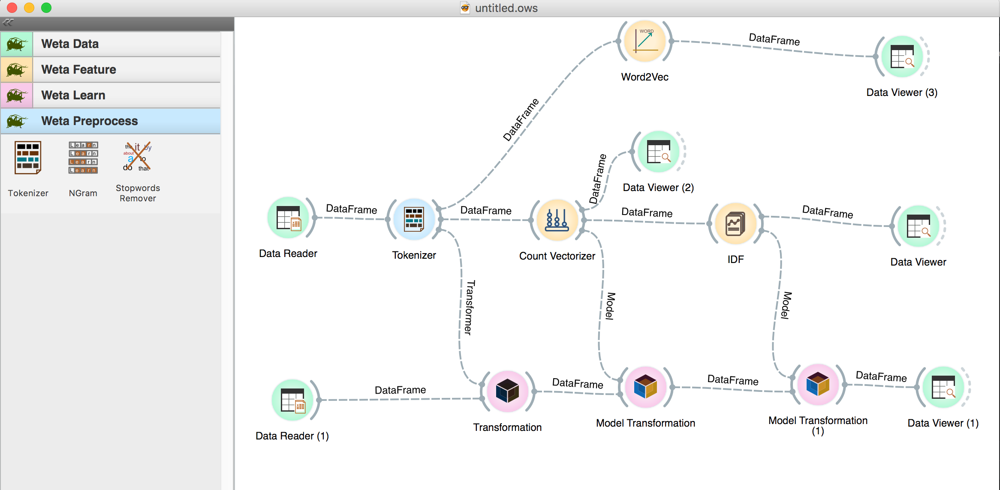
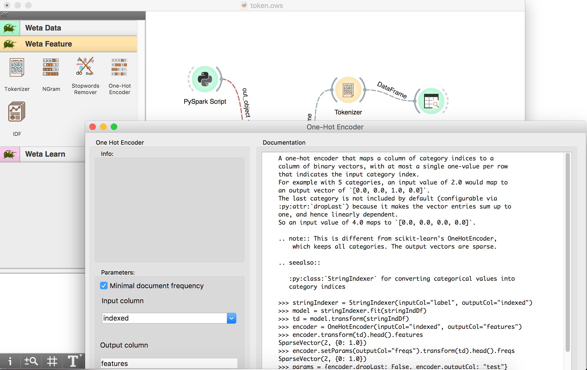
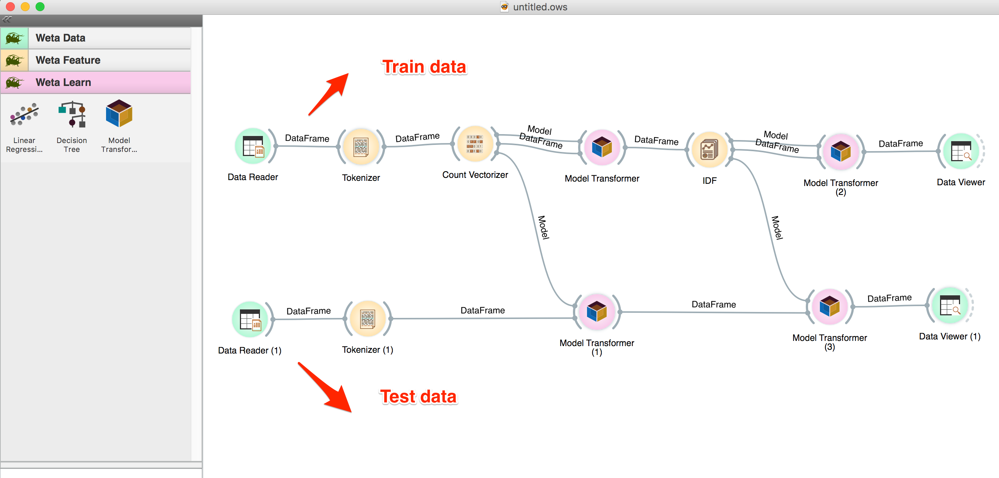

WETA 
======================

- What is WETA?

WATA is Workflow Environment for Text Analytics which provides a lot of Text Mining toolkit and a visual workflow canvas.

It is an abstract layer standing on the gaits' shoulders, including a variety of open source NLP libraries, text analytics
tools and Spark ecosystem.
The aim is to integrate them in data representation, API, workflow/pipeline, and facilitate these solid but usually overlaid
algorithms to ease text analytics tasks.

P.S. Weta is also a kind of insect in New Zealand.

## install

Detailed documentation can be found here: https://git.cms.waikato.ac.nz/cy97/weta/wikis

install Anaconda first.

Then `conda install pyspark plotly pandas Orange3`

## Building blocks

- Ingestion: scrapping, aggregation
- Copus management
- Preprocessing: tokenization, parsing, POS tagging, stemming, lemmatization, wrangling
- Feature engineering: vectorization, dimension reducing
- Machine Learning: model selection, hyperparameter tuning
- Visualization
- Misc.: persistence, visual pipeline building, batch running
- Workbench: codeless workflow building on canvas

Features
--------

  * A Spark Context.
  * A Dataframe from an SQL Query.
  * A Dataset Builder, basically a call to VectorAssembler, this is usefull before sending data to Estimators.
  * Transformers from the feature module.
  * Estimators from classification module.
  * Estimators from regression module.
  * Estimators from clustering module.
  * Evaluation from evaluator module.
  * A PySpark script executor + PySpark console.
  * DataFrame transformes for Pandas and Orangle Tables

## 3rd-party libraries

### data and machine learning
- Pandas
- Scikit-learn
- pandas_ml

### nlp and text mining domain
- NLTK
- gensim
- spaCy
- Pattern
- Textbot

- PyTorch

word embeddings
- word2vec
- gloVe

DSSM
DSSM

## Credits

The GUI is proudly powered by [Orange3](http://orange.biolab.si).
